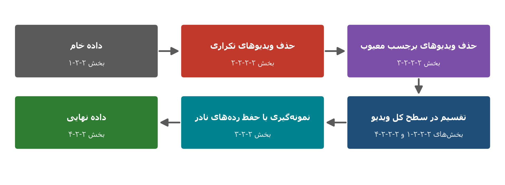
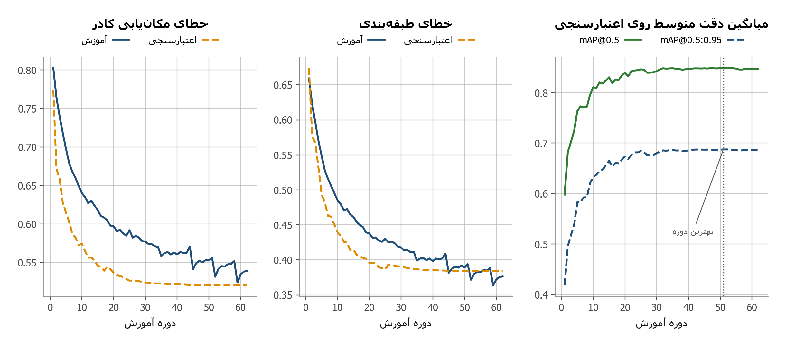

# Traffic Object Detection with YOLOv11 on IADD

An undergraduate Computer Engineering project on traffic-object detection in Iranian driving scenes. The project fine-tunes **YOLOv11s** on a carefully rebuilt subset of the **Iranian Autonomous Driving Dataset (IADD)** and focuses on both model performance and the validity of the evaluation protocol.

The six detection classes are:

- Person
- Car
- Motorcycle
- Bus
- Truck
- Traffic light

## Project Overview

The public IADD package contains real driving scenes collected in several Iranian cities and under different environmental conditions. During the initial data audit, the following issues were identified:

- The public test images did not include accessible label files.
- Frames originating from the same video could appear in different official splits.
- Three duplicate-video pairs were detected.
- Two videos contained confirmed labeling problems.
- Class frequency, object size, and environmental conditions were strongly imbalanced.

To obtain a more reliable evaluation, the labeled IADD data were rebuilt into a new subset using a **whole-video split**. All frames belonging to one video were assigned to exactly one of the training, validation, or test sets. Duplicate and invalid videos were excluded before sampling.



## Final Dataset Subset

| Split | Videos | Images | Object instances | Instances per image |
|---|---:|---:|---:|---:|
| Training | 79 | 26,000 | 204,009 | 7.85 |
| Validation | 39 | 5,571 | 36,810 | 6.61 |
| Test | 42 | 5,571 | 34,994 | 6.28 |
| **Total** | **160** | **37,142** | **275,813** | — |

The split builder balances the data using video-level information about:

- Rare classes: motorcycle, bus, and traffic light
- Environmental conditions: day, night, rain, and cloudy scenes
- Object-size distribution
- Target image counts of approximately 70% / 15% / 15%

The final subset itself is not included in this repository. Download the source dataset from the [official IADD repository](https://github.com/ahv1373/IADD), then update the local paths in the subset-building scripts.

## Dataset Cleaning

The following videos were excluded before creating the final subset:

- Confirmed labeling problems: `Record426_D`, `Record046_D`
- One member of each duplicate pair: `Record407_D`, `Record416_R`, `Record043_D`

Duplicate candidates were screened using perceptual difference hashes and then verified by visual inspection of matched frames and temporal sequences. Label problems were confirmed by drawing the original YOLO annotations on sampled frames and inspecting the resulting boxes.

## Model and Training

The final model is **YOLOv11s**, initialized from COCO-pretrained weights and fine-tuned on the rebuilt IADD subset.

Main configuration:

| Setting | Value |
|---|---:|
| Input size | 1280 px |
| Batch size | 12 |
| Optimizer | AdamW |
| Initial learning rate | 0.001 |
| Learning-rate schedule | Cosine |
| Epochs | 62 |
| Early-stopping patience | 10 |
| MixUp probability | 0.1 |
| Rotation | 5 degrees |
| Brightness variation (`hsv_v`) | 0.4 |

The complete training and evaluation workflow is available in:

[`code/IADD_YOLOv11_Colab_run8.ipynb`](code/IADD_YOLOv11_Colab_run8.ipynb)

## Final Test Results

The selected model reached:

| Metric | Test result |
|---|---:|
| Precision | 0.803 |
| Recall | 0.818 |
| F1 score | 0.808 |
| mAP@0.5 | **0.874** |
| mAP@0.5:0.95 | **0.707** |

Per-class AP@0.5:

| Class | AP@0.5 |
|---|---:|
| Person | 0.868 |
| Car | 0.969 |
| Motorcycle | 0.928 |
| Bus | 0.798 |
| Truck | 0.867 |
| Traffic light | 0.813 |



## Repository Structure

```text
car-detection-yolo/
├── code/                       # Dataset preparation, training, evaluation, and plotting code
├── figure and table data/      # CSV, JSON, and NPZ data used to reproduce tables and plots
├── figures/                    # Thesis and presentation figures
├── presentation and thesis/   # Final thesis and defense presentation
├── record review/              # Video-level audit summaries and evidence
└── runs/                       # Saved outputs for the baseline and final experiments
```

### Important Files

- `code/build_subset_v5.py` — builds the final video-level dataset split.
- `code/audit_duplicate_pairs.py` — reproduces the duplicate-video screening.
- `code/make_label_evidence.py` — draws original labels for visual inspection.
- `code/compute_v5_validity.py` — calculates split statistics and distributions.
- `code/IADD_YOLOv11_Colab_run8.ipynb` — final training and evaluation notebook.
- `code/export_eval_curves.py` — exports evaluation curves for later plotting.
- `code/make_figures_ch2.py` — creates dataset-analysis figures.
- `code/make_figures_ch3.py` — creates model-result figures.

## Reproducing the Workflow

1. Install Python and the required packages:

   ```bash
   pip install ultralytics numpy pandas matplotlib pillow opencv-python
   ```

2. Download IADD from its [official repository](https://github.com/ahv1373/IADD).
3. Update `SRC` and `OUT` in `code/build_subset_v5.py`.
4. Build the final subset:

   ```bash
   python code/build_subset_v5.py
   ```

5. Upload the subset to Google Drive or make it available to Colab.
6. Run `code/IADD_YOLOv11_Colab_run8.ipynb` in order.
7. Use the exported CSV, JSON, and NPZ files to reproduce the thesis figures.

## Documents

- [Thesis PDF](presentation%20and%20thesis/thesis.pdf)
- [Thesis source](presentation%20and%20thesis/thesis.docx)
- [Defense presentation PDF](presentation%20and%20thesis/presentation.pdf)
- [Defense presentation source](presentation%20and%20thesis/presentation.pptx)

## References

The primary dataset reference is:

> A. Khosravian, A. Amirkhani, M. Masih-Tehrani, and A. Yazdanijoo, “Multi-domain autonomous driving dataset: Towards enhancing the generalization of the convolutional neural networks in new environments,” *IET Image Processing*, vol. 17, pp. 1253–1266, 2023. [https://doi.org/10.1049/ipr2.12710](https://doi.org/10.1049/ipr2.12710)

Additional references are listed in the thesis.

## Notes

- The original IADD images and the rebuilt dataset subset are not redistributed in this repository.
- Saved run artifacts are included for reproducibility and result verification.
- The repository documents an undergraduate academic project and does not provide production autonomous-driving software.
